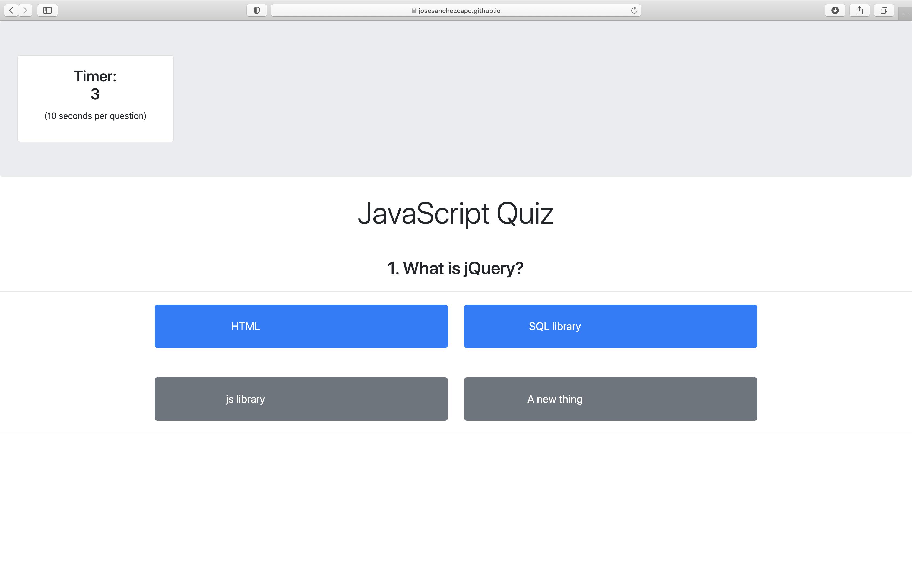

# Assignment: JavaScript Quiz
```bash
bc04-code-quiz
Web APIs: Code Quiz
```
```
The objective was to create a multiple choice quiz using JavaScript; in this quiz, 
the user will have to choose the correct answer out of 4 choices in less than 10 seconds; 
if the user didn't answer the question in 10sec, it would go to the next question automatically,
 and the question is marked wrong. 
 
  At the end of the quiz, the system will ask for the User Name and show the results.

```

# Project Url

[https://josesanchezcapo.github.io/bc04-code-quiz/](https://josesanchezcapo.github.io/bc04-code-quiz/)

## User Story

```
AS A coding boot camp student
I WANT to take a timed quiz on JavaScript fundamentals that stores high scores
SO THAT I can gauge my progress compared to my peers
```

## Mock-Up


